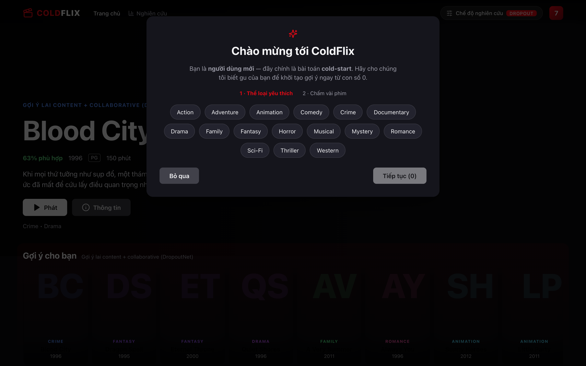
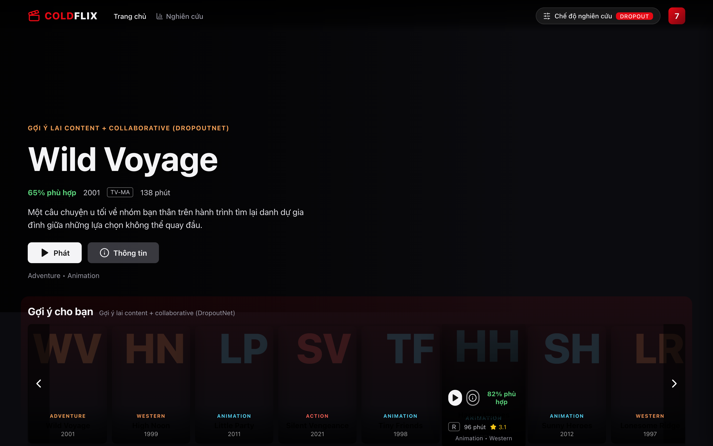
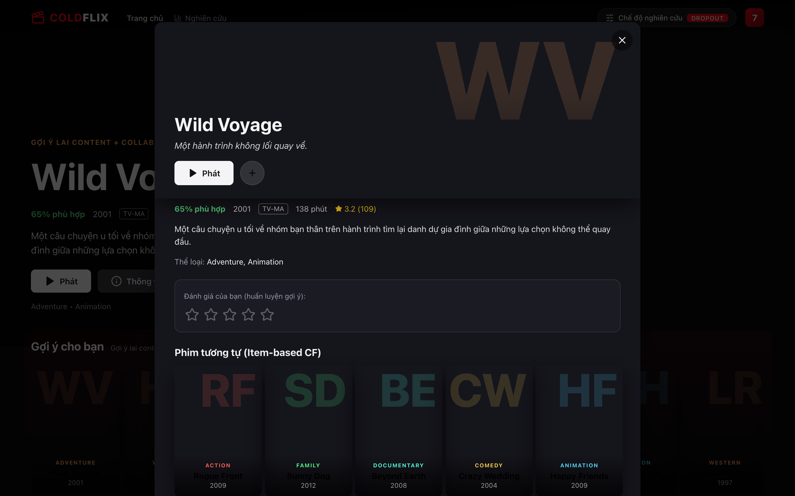
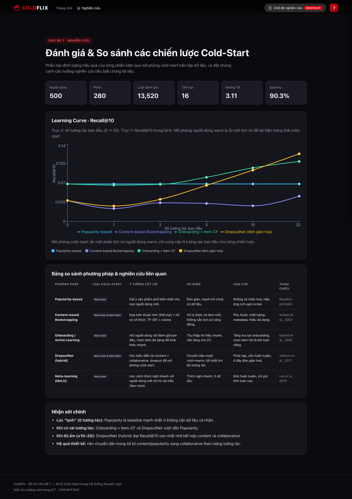

# 🎬 ColdFlix — Cold-Start Recommendation System

> **Chủ đề 7:** Xử lý vấn đề **Cold-Start** trong Hệ thống Khuyến nghị
> Môn: *Xu hướng mới trong ICT* · CHKHMT15A1

Một ứng dụng full-stack mô phỏng giao diện xem phim kiểu **Netflix** ("ColdFlix"),
đồng thời là **bàn thí nghiệm nghiên cứu** so sánh 5 chiến lược xử lý cold-start.
Người dùng mới trải qua bước *onboarding* (chọn thể loại + chấm điểm vài phim) —
chính là tình huống cold-start — rồi xem hàng **"Gợi ý cho bạn"** thay đổi theo
từng chiến lược, và một trang **Nghiên cứu** định lượng hiệu quả bằng learning curve.

| | |
|---|---|
| **Frontend** | React 19 + Vite + TypeScript + Recharts (giao diện Netflix, poster sinh bằng CSS, offline) |
| **Backend** | FastAPI + scikit-learn (TF-IDF, Item-CF, TruncatedSVD) |
| **Dữ liệu** | Synthetic có cấu trúc sở thích: 280 phim · 500 người dùng · 13.5K đánh giá |

---

## 🖼️ Giao diện

| Onboarding (cold-start hook) | Trang chủ kiểu Netflix |
|---|---|
|  |  |
| **Modal chi tiết + chấm điểm** | **Trang Nghiên cứu (learning curve)** |
|  |  |

---

## 🚀 Chạy nhanh

### Cách 1 — Docker (1 lệnh, khuyến nghị cho mạng thường)

```bash
docker compose up --build
# Mở http://localhost:8080   (API docs: http://localhost:8000/docs)
```

> ⚠️ **Lưu ý môi trường có proxy:** nếu máy bạn buộc Docker đi qua một MITM proxy
> (vd Docker Desktop đặt `HTTP Proxy = http.docker.internal:3128`), bước cài gói
> trong container có thể lỗi *hash mismatch* hoặc timeout. Khi đó hãy tắt proxy
> trong **Docker Desktop → Settings → Resources → Proxies**, hoặc dùng Cách 1b / Cách 2.

### Cách 1b — Docker offline (né proxy: all-in-one, cài gói từ wheel dựng sẵn)

Dùng khi proxy chặn việc tải gói trong container. Một container FastAPI phục vụ
cả API lẫn frontend tĩnh, cài Python từ wheel build sẵn trên host:

```bash
# Chuẩn bị (host, mạng sạch):
cd backend && pip download -r requirements.txt -d wheels \
    --platform manylinux2014_aarch64 --python-version 3.12 --only-binary=:all:
cd ../frontend && npm install && npm run build
# Chạy:
cd .. && docker compose -f docker-compose.offline.yml up --build
# Mở http://localhost:8080
```

> 💡 Cần vài GB dung lượng trống cho Docker. Nếu gặp `input/output error` khi
> build → **ổ đĩa đã đầy**, hãy giải phóng dung lượng trước.

### Cách 2 — Chạy dev trực tiếp (đã kiểm chứng hoạt động)

```bash
# Terminal 1 — Backend
cd backend
python3 -m venv .venv && source .venv/bin/activate
pip install -r requirements.txt
uvicorn app.main:app --reload --port 8000

# Terminal 2 — Frontend
cd frontend
npm install
npm run dev
# Mở http://localhost:5173
```

Hoặc dùng `Makefile`: `make install`, rồi `make backend` và `make frontend`.

---

## 🧠 5 chiến lược Cold-Start

| Chiến lược | Loại cold-start | Ý tưởng |
|---|---|---|
| **Popularity-based** | New User | `score(i) = log(|U_i| + 1)` — baseline không cá nhân hoá |
| **Content-based Bootstrapping** | New User & New Item | TF-IDF trên thể loại + cosine với hồ sơ sở thích |
| **Onboarding + Item-CF** | New User | Chấm vài phim đa dạng → Item-based Collaborative Filtering |
| **DropoutNet (đơn giản hoá)** | New User & New Item | Lai content + collaborative (SVD), trọng số content ↑ khi ít tương tác |
| **Item-CF (Warm User)** | Warm User | Đối chứng khi đã hết cold-start |

Kết quả thực nghiệm (Recall@10) cho thấy đúng câu chuyện cold-start: Popularity
mạnh nhất lúc "lạnh", còn DropoutNet vượt lên khi đã có đủ tương tác. Xem chi tiết
trong trang **Nghiên cứu** của app và trong `docs/report/`.

---

## 📂 Cấu trúc

```
ICT/
├── backend/                 # FastAPI + scikit-learn
│   ├── app/
│   │   ├── main.py          # REST API
│   │   ├── config.py
│   │   ├── models/schemas.py
│   │   └── services/        # dataset, recommender, evaluation
│   ├── data/sample/         # movies.csv, ratings.csv (synthetic)
│   ├── scripts/             # generate_synthetic.py, download_movielens.py
│   ├── tests/               # pytest
│   └── Dockerfile
├── frontend/                # React + Vite (giao diện Netflix)
│   ├── src/
│   │   ├── components/      # Hero, Row, MovieCard, DetailModal, OnboardingModal, ResearchPanel...
│   │   ├── pages/           # Home, Insights
│   │   ├── state/           # profile + ui context
│   │   ├── lib/poster.ts    # sinh poster gradient
│   │   └── api/client.ts
│   ├── nginx.conf
│   └── Dockerfile
├── slides/                  # Slide thuyết trình (reveal.js)
├── docs/report/             # Báo cáo nghiên cứu (.md + .docx)
├── docker-compose.yml
└── Makefile
```

---

## 🔌 API chính

| Method | Endpoint | Mô tả |
|---|---|---|
| GET | `/api/health` | Kiểm tra sống |
| GET | `/api/stats` | Thống kê dataset |
| GET | `/api/strategies` | Danh sách chiến lược |
| GET | `/api/genres` | Thể loại |
| GET | `/api/catalog` | Toàn bộ phim + metadata |
| GET | `/api/similar/{id}` | Phim tương tự (Item-CF) |
| GET | `/api/onboarding/items` | Phim onboarding đa dạng |
| POST | `/api/recommend` | Tạo khuyến nghị theo chiến lược |
| GET | `/api/evaluation/learning-curve` | Learning curve Recall@10 |

---

## 🧪 Kiểm thử

```bash
cd backend && .venv/bin/python -m pytest tests/ -q   # 10 test
```

## 📚 Tham khảo
- Schein et al. (2002) — *Methods and Metrics for Cold-Start Recommendations*
- Rashid et al. (2002) — *Getting to Know You: Learning New User Preferences*
- Volkovs et al. (2017) — *DropoutNet: Addressing Cold Start in RecSys*
- Lee et al. (2019) — *MeLU: Meta-Learned User Preference Estimator*
